# ⚡ Energy Trading DashBoard


<br />

### *How do we constrain a General-Purpose LLM (Llama 3) <br /> to act like a disciplined, domain-specific Financial Analyst?*

<br />


[](YOUR_STREAMLIT_APP_LINK_HERE)


---

## 🎯 The Experiment

This project was born from a specific engineering question: **Can we reliably use a generalist LLM (like Llama 3) to interpret complex, high-stakes market signals?**

Energy traders operate in two distinct realities:
1.  **The Quantitative World:** Precise time-series data (Prices, Volatility, Correlations).
2.  **The Qualitative World:** A chaotic flow of unstructured information (Geopolitics, Weather, Supply Shocks).

I built this system to **orchestrate** these two worlds. The goal was to create an **Autonomous Agent** capable of "reading" the news, filtering out media noise, and retaining only valid trading signals.

## 🏗️ System Architecture

The system follows a modular architecture that strictly separates data ingestion, mathematical analysis, and cognitive reasoning.

```mermaid
flowchart TD
    
    
    classDef data fill:#0a1929,stroke:#00e5ff,stroke-width:2px,color:#ffffff,rx:12,ry:12,shadow:shadow-cyan;
    
    classDef ai fill:#120a29,stroke:#d500f9,stroke-width:2px,color:#ffffff,rx:12,ry:12,shadow:shadow-magenta;
    
    classDef ui fill:#0a291a,stroke:#00e676,stroke-width:2px,color:#ffffff,rx:12,ry:12,shadow:shadow-green;
    
    classDef user fill:#29140a,stroke:#ff9100,stroke-width:2px,color:#ffffff,rx:50,ry:50;

    
    subgraph DataLayer ["🔹 Data Layer"]
        direction TB
        A[("📈 Yahoo Finance")]:::data
        C[("📰 NewsAPI")]:::data
        B["📥 Data Loader"]:::data
    end

    subgraph IntelLayer ["🧠 Intelligence Layer"]
        direction TB
        B -->|Time Series| D{"🧮 Analytics Engine"}:::ai
        D -->|Volatility Calculation| E["📉 Market Regimes"]:::ai
        
        B -->|Raw Text| F{"🤖 AI Agent"}:::ai
        F -->|Prompt Engineering| G["⚡ Llama 3 (Groq)"]:::ai
        G -->|Extraction| H["🎯 Trading Signal"]:::ai
    end

    subgraph ViewLayer ["💻 Presentation Layer"]
        direction TB
        E --> I["🚀 Streamlit Dashboard"]:::ui
        H --> I
        I -->|Visual Insights| J("👤 Trader / User"):::user
    end

    
    linkStyle default stroke:#ffffff,stroke-width:2px,fill:none;
    A --> B
    C --> B

   
    
    style DataLayer fill:#161b22,stroke:#004dcf,stroke-width:1px,stroke-dasharray: 5 5,color:#fff
    style IntelLayer fill:#161b22,stroke:#7c4dff,stroke-width:1px,stroke-dasharray: 5 5,color:#fff
    style ViewLayer fill:#161b22,stroke:#00bfa5,stroke-width:1px,stroke-dasharray: 5 5,color:#fff
```



## 🧠 The AI Brain (Prompt Engineering)

To mitigate LLM hallucinations and ensure reliability, I implemented a strict logic layer:

1.  **Context Injection:** The agent is assigned a specific role ("Energy Trader") with hard-coded domain rules.
2.  **Noise Filtering:** Explicit instructions to ignore "celebrity news" or "general politics" and focus solely on **Supply/Demand Shocks**.
3.  **Structured Output (Pydantic):** Instead of free text, the model is forced to return a validated JSON schema (`Category`, `Sentiment`, `Action`).

```python
# Logic injected into the System Prompt
CRITICAL RULES:
1. SUPPLY DISRUPTION (War, Strikes, Leaks) -> BULLISH (Prices UP)
2. NEW SUPPLY (New pipeline, Deal signed) -> BEARISH (Prices DOWN)
3. DEMAND DESTRUCTION (Warm winter, Recession) -> BEARISH
```

## 📊 Key Features

### 1. Quantitative Engine 
* **Normalized True Range:** Calculates volatility as a percentage of price (`TR / Close`), capturing intraday gaps that standard deviation misses.
* **Dual-Horizon Calibration:**
    * **Long-Term (5Y):** Defines "Crisis" thresholds based on historical tail events (e.g., Wars, Recessions).
    * **Short-Term (6M):** Adapts "High" and "Noise" thresholds to recent market conditions, making the system responsive to the current regime.
* **Instant Classification:** Compares real-time volatility against these dynamic baselines to trigger states (e.g., "Active Market" vs "Crisis").

### 2. Qualitative Engine 
* **Real-time Scraping:** Monitors global wires for targeted topics (Natural Gas, Crude Oil, LNG).
* **Event Classification:** Automatically tags events as `Supply Shock`, `Geopolitical`, or `Weather Event`.
* **Actionable Insights:** The AI suggests a directional bias (Bullish/Bearish) based on the news content.


## 🛠️ Technical Stack

* **Language:** Python 3.11
* **Frontend:** Streamlit (Cloud Deployment)
* **AI Engine:** Llama 3.1-8b (via Groq API)
* **Orchestration:** LangChain, Pydantic
* **Data Processing:** Pandas, NumPy, Yfinance
* **Visualization:** Plotly, Streamlit Native Charts
* **DevOps:** Git, Environment Variables Management

## 🚀 Installation & Setup

**1. Clone the repository**
```bash
git clone [https://github.com/Antonin-MORENO/energy-trading-agent.git](https://github.com/Antonin-MORENO/energy-trading-agent.git)
cd energy-trading-agent
```

**2. Install dependencies**
```bash
pip install -r requirements.txt
```

**3. Configure API Keys**
This project requires two free API keys to function:
* **Groq Cloud (LLM):** [Get a free API Key here](https://console.groq.com/keys)
* **NewsAPI (Data):** [Get a free API Key here](https://newsapi.org/register)

Create a `.env` file at the root of the project and paste your keys:
```env
GROQ_API_KEY=gsk_your_key_here...
NEWS_API_KEY=your_newsapi_key_here...
```

**4. Run the Application**
```bash
streamlit run dashboard.py
```

## 📈 Future Improvements

* **Social Media Analysis:** Integrating Twitter/X sentiment to capture retail market mood.
* **Weather-Driven Demand:** Correlating forecast data (HDD/CDD metrics) with Natural Gas prices to anticipate heating/cooling demand spikes.
* **Model Evaluation Protocol:** Implementing a simple loop to assess the AI's relevance:
    * *Reality Check:* Comparing AI signals against actual next-day price movements.
    * *Error Analysis:* Reviewing "false positives" to refine the System Prompt constraints.
    * *Confidence Scoring:* Asking the LLM to rate its certainty (1-10) to filter weak signals.

---
*Project created by Antonin MORENO - Open Source under MIT License.*
